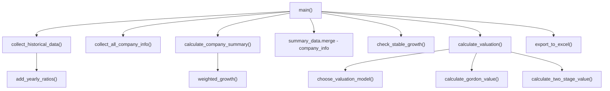

# Документация: Скрипт анализа дивидендных аристократов

## Общая цель

Скрипт автоматизирует фундаментальный анализ **Дивидендных Аристократов** — компаний из индекса S&P 500, которые повышали дивиденды не менее 25 лет подряд. Скрипт:

1. Скачивает финансовую отчётность из Yahoo Finance
2. Рассчитывает финансовые коэффициенты за каждый год
3. Считает средние значения и темпы роста (CAGR) за весь период
4. Проверяет, подходит ли компания под модель стабильного роста
5. Оценивает справедливую стоимость акции (модель Гордона или двухстадийная)
6. Выгружает всё в Excel-файл с множеством листов

---

## Архитектура: порядок выполнения



---

## Константы и допущения

| Константа | Значение | Что означает |
|---|---|---|
| `YEARS` | `[2022, 2023, 2024, 2025]` | Годы, за которые собираем отчётность |
| `RISK_FREE_RATE` | 4.306% | Безрисковая ставка (доходность гособлигаций США) |
| `MARKET_RISK_PREMIUM` | 5.0% | Премия за рыночный риск |
| `ECONOMY_GROWTH` | 2.4% | Долгосрочный номинальный рост экономики США |
| `MAX_GROWTH_GAP` | 1.0% | Максимальное превышение роста компании над экономикой для модели Гордона |
| `MAX_DPS_EPS_GAP` | 2.0% | Максимальная разница CAGR дивидендов и прибыли |
| `HIGH_GROWTH_YEARS` | 5 | Период быстрого роста в двухстадийной модели |
| `MAX_HIGH_GROWTH` | 15% | Верхний предел темпа роста в фазе быстрого роста |
| `OUTPUT_PATH` | `dividend_aristocrats_analysis.xlsx` | Путь к выходному Excel-файлу |

---

## Этап 1. Сбор исходных данных

### Функция `collect_historical_data()`
**Строки:** 330–373. Проходит по каждому тикеру и каждому году, скачивает три отчёта из Yahoo Finance и собирает все данные в одну большую таблицу.

Для каждого тикера один раз загружаются:
- `ticker.income_stmt` — Отчёт о прибылях и убытках
- `ticker.balance_sheet` — Баланс
- `ticker.cashflow` — Отчёт о движении денежных средств
- `ticker.dividends` — История дивидендных выплат на акцию

Затем для каждого года вызывается `collect_company_year()`.

### Функция `collect_company_year()`
**Строки:** 113–228. Извлекает конкретные строки из отчётности за один год.

#### Из Income Statement:

| Показатель | Строка в yfinance | Описание |
|---|---|---|
| **Revenue** | `Total Revenue` | Общая выручка компании |
| **Net Income** | `Net Income` / `Net Income Common Stockholders` | Чистая прибыль |
| **EPS** | `Diluted EPS` | Разводнённая прибыль на акцию |
| **Diluted Shares** | `Diluted Average Shares` | Средневзвешенное число разводнённых акций |
| **EBITDA** | `EBITDA` | Прибыль до процентов, налогов, износа и амортизации |
| **EBIT** | `EBIT` / `Operating Income` | Операционная прибыль |
| **Interest Expense** | `Interest Expense` / `Interest Expense Non Operating` | Процентные расходы (берётся модуль) |

#### Из Balance Sheet:

| Показатель | Строка в yfinance | Описание |
|---|---|---|
| **Equity** | `Stockholders Equity` / `Common Stock Equity` / `Total Equity Gross Minority Interest` | Собственный капитал на конец года |
| **Previous Equity** | Те же строки, но за `year - 1` | Собственный капитал на конец предыдущего года |
| **Average Equity** | Расчётный | `(Equity + Previous Equity) / 2`. Если Previous Equity нет — берётся Equity |
| **Total Debt** | `Total Debt` | Общий долг |
| **Cash** | `Cash And Cash Equivalents` / `Cash Cash Equivalents And Short Term Investments` | Денежные средства |
| **Current Assets** | `Current Assets` | Оборотные активы |
| **Current Liabilities** | `Current Liabilities` | Краткосрочные обязательства |
| **Inventory** | `Inventory` | Запасы |

#### Из Cash Flow Statement:

| Показатель | Строка в yfinance | Описание |
|---|---|---|
| **Operating Cash Flow** | `Operating Cash Flow` | Операционный денежный поток |
| **Capital Expenditure** | `Capital Expenditure` | Капитальные затраты |
| **FCF** | `Free Cash Flow` | Свободный денежный поток. Если нет — считается как `OCF + CapEx` |
| **Common Dividends Paid** | `Common Stock Dividend Paid` / `Cash Dividends Paid` | Выплаченные дивиденды (берётся модуль) |

#### DPS (дивиденды на акцию):
1. **Основной способ:** Из `ticker.dividends` суммируются все выплаты за календарный год
2. **Запасной способ:** Если данных нет — `DPS = Common Dividends Paid / Diluted Shares`

### Функция `collect_company_info()`
**Строки:** 231–247. Собирает **текущую** справочную информацию о компании.

| Поле | Источник | Описание |
|---|---|---|
| Name | `shortName` | Краткое название компании |
| Yahoo Sector | `sector` | Сектор по классификации Yahoo |
| Yahoo Industry | `industry` | Отрасль по классификации Yahoo |
| Price | `currentPrice` | Текущая цена акции |
| Beta | `beta` | Бета-коэффициент (мера рыночного риска) |
| Enterprise Value | `enterpriseValue` | Стоимость предприятия |
| Market Cap | `marketCap` | Рыночная капитализация |
| Shares Outstanding | `sharesOutstanding` | Количество акций в обращении |

---

## Этап 2. Расчёт годовых коэффициентов

### Функция `add_yearly_ratios()`
**Строки:** 274–327. Для каждой строки (компания x год) рассчитывает финансовые коэффициенты.

### Показатели рентабельности

| Показатель | Формула | Смысл |
|---|---|---|
| **ROE** | `Net Income / Average Equity` | Рентабельность собственного капитала |

### Показатели дивидендной политики

| Показатель | Формула | Смысл |
|---|---|---|
| **Payout Ratio based on NI** | `Common Dividends Paid / Net Income` | Доля чистой прибыли, отданная в виде дивидендов |
| **Payout Ratio based on FCF** | `Common Dividends Paid / FCF` | Доля свободного денежного потока, отданная в виде дивидендов |

### Показатели долговой нагрузки

| Показатель | Формула | Смысл |
|---|---|---|
| **D/E** | `Total Debt / Equity` | Отношение долга к собственному капиталу |
| **Net Debt** | `Total Debt - Cash` | Чистый долг (долг минус деньги на счетах) |
| **Net Debt / EBITDA** | `Net Debt / EBITDA` | За сколько лет компания может погасить чистый долг. Норма менее 3x |
| **Interest Coverage** | `EBIT / Interest Expense` | Во сколько раз операционная прибыль превышает процентные платежи. Норма более 3x |

### Показатели ликвидности

| Показатель | Формула | Смысл |
|---|---|---|
| **Current Ratio** | `Current Assets / Current Liabilities` | Коэффициент текущей ликвидности. Норма более 1.0 |
| **Quick Ratio** | `(Current Assets - Inventory) / Current Liabilities` | Коэффициент быстрой ликвидности (без запасов) |
| **OCF / Total Debt** | `Operating Cash Flow / Total Debt` | Доля долга, покрываемая годовым операционным потоком |

---

## Этап 3. Сводные показатели за весь период

### Функция `calculate_company_summary()`
**Строки:** 376–425. Для каждой компании считает темпы роста (CAGR) и средние значения.

### CAGR (Compound Annual Growth Rate)

**Формула:**
```
CAGR = (Конечное значение / Начальное значение) ^ (1 / Кол-во лет) - 1
```

> [!IMPORTANT]
> CAGR считается **только** если начальное и конечное значения **положительные**. Для отрицательной прибыли CAGR не имеет финансового смысла.

| CAGR | Что показывает |
|---|---|
| **Revenue CAGR** | Среднегодовой рост выручки |
| **Net Income CAGR** | Среднегодовой рост чистой прибыли |
| **EPS CAGR** | Среднегодовой рост прибыли на акцию |
| **DPS CAGR** | Среднегодовой рост дивидендов на акцию |
| **FCF CAGR** | Среднегодовой рост свободного денежного потока |

### Company Growth CAGR (взвешенный рост)

**Функция:** `weighted_growth()` (строки 87–110). Средневзвешенное нескольких CAGR:

| Метрика | Вес | Почему такой вес |
|---|---|---|
| Revenue CAGR | 30% | Выручка — базовый показатель масштаба бизнеса |
| FCF CAGR | 30% | Реальные деньги, которые генерирует бизнес |
| EPS CAGR | 25% | Прибыль на акцию — ключевой показатель для акционеров |
| DPS CAGR | 15% | Рост дивидендов может быть за счёт увеличения payout |

Если какой-то CAGR отсутствует (NA), его вес перераспределяется пропорционально.

---

## Этап 4. Проверка стабильного роста

### Функция `check_stable_growth()`
**Строки:** 447–483. Определяет, подходит ли компания для модели Гордона.

Компания считается **Stable Growth Suitable = True**, если выполнены **все 4 условия**:

| Условие | Проверка | Логика |
|---|---|---|
| **Growth Close To Economy** | `Company Growth CAGR <= 3.4%` | Компания не может расти быстрее экономики бесконечно |
| **DPS Close To EPS** | Разница DPS CAGR и EPS CAGR не более 2% | Дивиденды растут примерно с той же скоростью, что и прибыль |
| **FCF Payout Safe** | `Average Payout FCF <= Отраслевой лимит` | Компания не отдаёт слишком много FCF в дивиденды |
| **FCF Growth Positive** | `FCF CAGR > 0` | Свободный денежный поток растёт |

#### Отраслевые лимиты Payout FCF:

| Сектор | Лимит | Почему |
|---|---|---|
| Real Estate | 90% | Стабильные арендные потоки |
| Consumer Defensive, Utilities | 85% | Предсказуемый спрос |
| Healthcare, Industrials, Financial Services | 75% | Умеренная цикличность |
| Consumer Cyclical, Basic Materials, Energy | 70% | Высокая цикличность |
| Technology | 65% | Нужны большие инвестиции в R&D |
| Прочие | 80% | По умолчанию |

---

## Этап 5. Выбор модели оценки и расчёт справедливой стоимости

### Выбор модели (`choose_valuation_model`)

| Результат проверки | Модель |
|---|---|
| Stable Growth Suitable = True | **Gordon** (одностадийная) |
| Company Growth CAGR > 3.4% | **Two-stage** (двухстадийная) |
| Иначе | **Manual review** |

### Cost of Equity (модель CAPM)
```
Cost of Equity = Risk-Free Rate + Beta x Market Risk Premium
               = 4.306% + Beta x 5.0%
```

### Модель Гордона
**Функция:** `calculate_gordon_value()` (строки 505–522)

```
Fair Value = D1 / (r - g)
```

- **D1** = `Latest DPS x (1 + g)` — ожидаемый дивиденд через год
- **r** = Cost of Equity
- **g** = Company Growth CAGR (ограничен до 3.4%)

> [!WARNING]
> Если `r <= g`, формула даёт бесконечность — возвращается NA.

**Пример:** DPS = $3.00, g = 3%, r = 7%
- D1 = 3.00 x 1.03 = 3.09
- Fair Value = 3.09 / (0.07 - 0.03) = **$77.25**

### Двухстадийная модель
**Функция:** `calculate_two_stage_value()` (строки 525–550)

**Фаза 1 (быстрый рост, 5 лет):**
```
Для каждого года i от 1 до 5:
    Di = Di-1 x (1 + high_growth)
    PV(Di) = Di / (1 + r)^i
```

**Фаза 2 (стабильный рост, бесконечность):**
```
Terminal Dividend = D5 x (1 + stable_growth)
Terminal Value = Terminal Dividend / (r - stable_growth)
PV(Terminal Value) = Terminal Value / (1 + r)^5
```

**Итого:**
```
Fair Value = сумма PV(Di) + PV(Terminal Value)
```

- **high_growth** = Company Growth CAGR (ограничен от 2.4% до 15%)
- **stable_growth** = 2.4% (рост экономики)

### Upside / Downside
```
Upside/Downside = (Selected Fair Value / Price) - 1
```
- Положительное значение — акция **недооценена**
- Отрицательное значение — акция **переоценена**

---

## Этап 6. Экспорт в Excel

### Функция `export_to_excel()`
**Строки:** 598–626  
**Файл:** `dividend_aristocrats_analysis.xlsx`

#### Основные листы:

| Лист | Содержимое |
|---|---|
| **Raw Data** | Все собранные данные: каждая строка = компания x год |
| **Company Info** | Справочная информация: название, сектор, цена, бета, капитализация |
| **Summary** | Сводка: CAGR, средние коэффициенты, проверка стабильного роста |
| **Valuation** | Оценка стоимости: Cost of Equity, модель, Fair Value, Upside/Downside |

#### Листы по отдельным метрикам:

Каждый лист — сводная таблица (строки = тикеры, столбцы = годы) для одной из 15 метрик: Revenue, Net Income, EPS, DPS, FCF, Common Dividends Paid, ROE, Payout Ratio based on NI, Payout Ratio based on FCF, D/E, Net Debt / EBITDA, Interest Coverage, Current Ratio, Quick Ratio, OCF / Total Debt.

---

## Вспомогательные функции

| Функция | Строки | Назначение |
|---|---|---|
| `get_col_by_year()` | 31–41 | Находит колонку в таблице yfinance по году |
| `get_row_value()` | 44–57 | Безопасно извлекает значение из строки отчёта |
| `safe_abs()` | 60–63 | Модуль числа с обработкой NA |
| `safe_divide()` | 66–71 | Деление с защитой от NA и деления на ноль |
| `make_metric_sheet()` | 581–587 | Создаёт сводную таблицу (pivot) для одной метрики |
| `safe_sheet_name()` | 590–595 | Убирает запрещённые символы из имени листа Excel |

---

## Обработка ошибок

Код обрабатывает ошибки на трёх уровнях:

1. **Уровень загрузки отчётов** (`collect_historical_data`): Если yfinance не может скачать данные — пустые строки с `Warnings: download error`
2. **Уровень одного года** (`collect_company_year`): Ошибка при парсинге конкретного года — запись с `Warnings: row error`
3. **Уровень company info** (`collect_all_company_info`): Если не получается загрузить info — значения по умолчанию с `Info Error`
